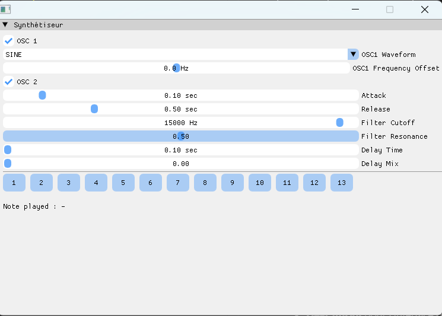

# Synthétiseur

Synthétiseur numérique soustractif temps réel développé en C++ dans le cadre du cours 4DEV4D. Il permet de jouer des notes depuis un clavier virtuel de 13 touches ou via des raccourcis clavier AZERTY, tout en façonnant le son à l'aide de deux oscillateurs, d'une enveloppe attaque/relâchement, d'un filtre passe-bas et d'un effet delay. L'application combine un moteur audio dédié pour la génération d'échantillons et le traitement du signal avec une interface légère en Dear ImGui pour contrôler les paramètres et interagir avec l'instrument en temps réel.


## Aperçu


---


##  Stack technique

- **C++23** pour le moteur audio et la logique applicative
- **CMake 3.30+** pour la configuration et le build du projet
- **PortAudio** pour la sortie audio stéréo temps réel à 44.1 kHz
- **SDL3** pour le fenêtrage, les entrées et le rendu
- **Dear ImGui** pour l'interface du synthétiseur
- Bibliothèques natives gérées par CMake pour Windows, macOS et Linux

---

## Fonctionnalités principales

- Deux oscillateurs : forme d'onde sélectionnable sur OSC1, onde en dents de scie sur OSC2
- Génération d'ondes sinus, carrée et dents de scie
- Contrôle du décalage de fréquence d'OSC1 de -5 Hz à +5 Hz
- Contrôles d'enveloppe attaque et relâchement
- Filtre passe-bas avec fréquence de coupure et résonance ajustables
- Effet delay avec contrôle du temps et du mix
- Clavier virtuel de 13 notes
- Raccourcis clavier AZERTY : `q`, `z`, `s`, `e`, `d`, `f`, `t`, `g`, `y`, `h`, `u`, `j`, `k`
- Lecture monophonique avec gestion note-on / note-off

---

## Flux du signal

L'audio est traité selon le pipeline suivant :

```
Oscillateur → Enveloppe → Filtre → Delay → Sortie audio
```

Le callback audio s'exécute indépendamment du thread de l'interface graphique. Les paramètres partagés du synthétiseur sont protégés pour un accès sûr entre les deux flux d'exécution.

---

##  Structure du projet

```
audio/       Traitement de l'oscillateur, de l'enveloppe, du filtre et du delay
gui/         Fenêtre de l'application Dear ImGui
libraries/   Dépendances Dear ImGui, SDL3 et PortAudio
main.cpp     Point d'entrée de l'application
```

---

## Build

### Prérequis

- CMake 3.30 ou supérieur
- Un compilateur compatible C++23
- Une plateforme supportée : Windows, macOS ou Linux

Les sources ou binaires requis de SDL3, PortAudio et Dear ImGui sont inclus dans `libraries/`.

### Configurer et compiler

```bash
cmake -S . -B build
cmake --build build --config Debug
```

L'exécutable est généré sous le nom `synth-60991` (ou `synth-60991.exe` sous Windows). Sur Windows, les DLL SDL3 et PortAudio requises sont copiées automatiquement à côté de l'exécutable par CMake.

---

## Architecture audio

Chaque étage de traitement est implémenté comme une classe C++ dédiée. Le moteur audio est responsable de la génération des échantillons et de l'application de la chaîne de traitement du signal, tandis que l'interface graphique expose les paramètres du synthétiseur et les contrôles clavier.

---


## 👤 Auteur

Aninia Abla Negue— 4DEV4D
